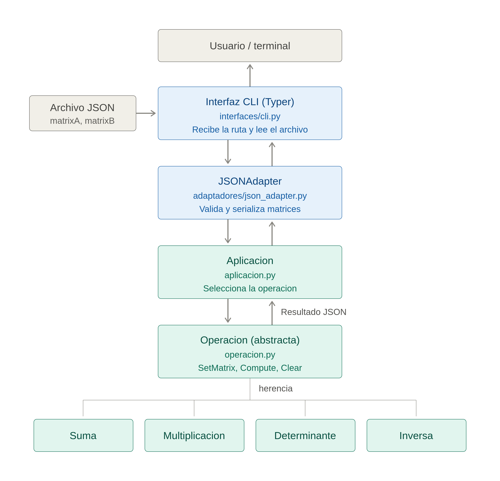

````markdown
# Calculadora de matrices en Python

Procesador mínimo para una calculadora de matrices en Python, con entrada JSON y operaciones de suma, multiplicación, determinante e inversa, desarrollado bajo una arquitectura Interfaz-Adaptador.

## Funcionalidades
- Suma de dos matrices.
- Multiplicación de dos matrices.
- Cálculo del determinante de dos matrices.
- Cálculo de la inversa de dos matrices.
- Lectura y validación de matrices en formato JSON.
- Interfaz de línea de comandos desarrollada con Typer.
- Presentación del resultado en formato JSON.

## Arquitectura

La solución separa la entrada del usuario, el procesamiento del JSON y las operaciones matemáticas. La interfaz desarrollada con Typer recibe la operación y la ruta del archivo. El adaptador convierte y valida la información del JSON, mientras que la clase `Aplicacion` selecciona la operación correspondiente. Las clases `Suma`, `Multiplicacion`, `Determinante` e `Inversa` implementan los métodos definidos por la clase abstracta `Operacion`.



## Estructura del proyecto

```text
.
├── docs/
│   └── arquitectura.png
├── ejemplos/
│   └── matrices.json
├── src/
│   └── calculadora/
│       ├── adaptadores/
│       │   └── json_adapter.py
│       ├── interfaces/
│       │   └── cli.py
│       ├── operaciones/
│       │   ├── determinante.py
│       │   ├── inversa.py
│       │   ├── multiplicacion.py
│       │   └── suma.py
│       ├── __init__.py
│       ├── aplicacion.py
│       └── operacion.py
├── pyproject.toml
└── uv.lock
```

## Requisitos

Para ejecutar el proyecto se necesita:

- Python 3.12 o superior.
- Git.
- UV.
- Una terminal.

### Instalación de UV

En Linux o macOS:

```bash
curl -LsSf https://astral.sh/uv/install.sh | sh
```


La documentación oficial está disponible en [Astral UV](https://docs.astral.sh/uv/getting-started/installation/).

## Instalación del proyecto

Clonar el repositorio:

```bash
git clone https://github.com/alearce08/Calculadora-de-matrices-en-Python.git
```

Entrar en la carpeta:

```bash
cd Calculadora-de-matrices-en-Python
```

Instalar las dependencias y crear el entorno virtual:

```bash
uv sync
```

## Formato de entrada

La calculadora recibe la ruta de un archivo JSON. El archivo debe contener `matrixA` y `matrixB`

Cada matriz debe incluir:

- `rows`: cantidad de filas.
- `cols`: cantidad de columnas.
- `data`: arreglo bidimensional con los valores numéricos.

Ejemplo:

```json
{
  "matrixA": {
    "rows": 2,
    "cols": 2,
    "data": [
      [1.0, 2.0],
      [3.0, 4.0]
    ]
  },
  "matrixB": {
    "rows": 2,
    "cols": 2,
    "data": [
      [5.0, 6.0],
      [7.0, 8.0]
    ]
  }
}
```

En el repositorio se incluye un archivo de prueba en `ejemplos/matrices.json`.

## Uso

La forma general del comando es:

```bash
uv run calculadora OPERACION archivo_json
```

Para consultar la ayuda:

```bash
uv run calculadora --help
```

### Suma

```bash
uv run calculadora suma ejemplos/matrices.json
```

Resultado:

```json
{
  "rows": 2,
  "cols": 2,
  "data": [
    [6.0, 8.0],
    [10.0, 12.0]
  ]
}
```

### Multiplicación

```bash
uv run calculadora multiplicacion ejemplos/matrices.json
```

Resultado:

```json
{
  "rows": 2,
  "cols": 2,
  "data": [
    [19.0, 22.0],
    [43.0, 50.0]
  ]
}
```


### Determinante

El determinante se calcula para `matrixA` y `matrixB`.

```bash
uv run calculadora determinante ejemplos/matrices.json
```

Resultado:

```json
{
  "matrixA": -2.0,
  "matrixB": -2.0
}
```

### Inversa

La inversa se calcula para `matrixA` y `matrixB`.

```bash
uv run calculadora inversa ejemplos/matrices.json
```

Resultado:

```json
{
  "matrixA": {
    "rows": 2,
    "cols": 2,
    "data": [
      [-2.0, 1.0],
      [1.5, -0.5]
    ]
  },
  "matrixB": {
    "rows": 2,
    "cols": 2,
    "data": [
      [-4.0, 3.0],
      [3.5, -2.5]
    ]
  }
}
```


## Validación y errores

La calculadora verifica:

- Que el archivo tenga un formato JSON válido.
- Que existan `matrixA` y `matrixB`.
- Que cada matriz contenga `rows`, `cols` y `data`.
- Que las dimensiones declaradas coincidan con los datos.
- Que los valores de las matrices sean numéricos.
- Que la operación solicitada exista.
- Que las dimensiones sean compatibles con la operación.
- Que las matrices utilizadas para determinante e inversa sean cuadradas.
- Que las matrices utilizadas para la inversa no sean singulares.
```


## Revisión del código

Para revisar el estilo y posibles errores:

```bash
uv run ruff check .
```

Para comprobar el formato:

```bash
uv run ruff format --check .
```

## Integrantes

- Alejandro Arce
- Brayan Solis

## Información académica

- **Curso:** Introducción a la Computación Heterogénea GR50
- **Profesor:** Luis Gerardo León Vega
- **Institución:** Instituto Tecnológico de Costa Rica
- **Periodo:** II semestre de 2026
````
